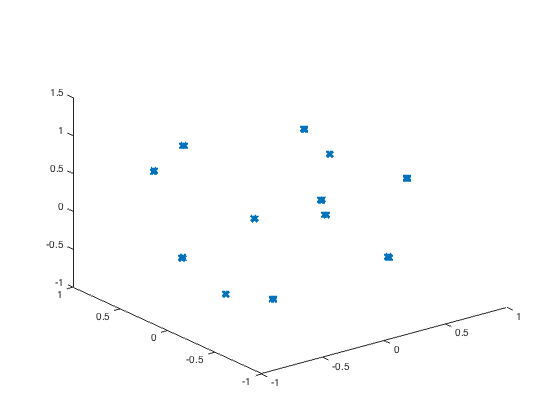
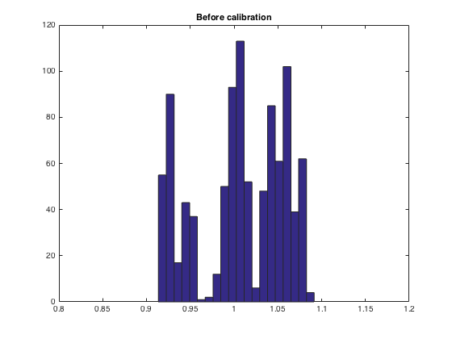
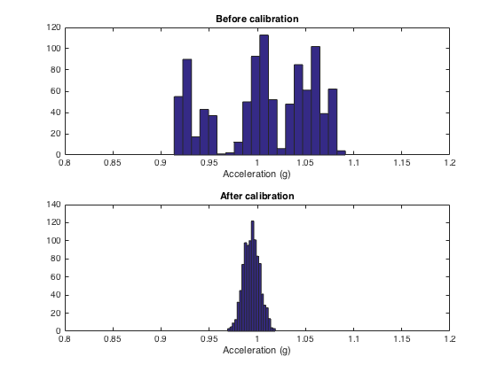

# Matlab Accelerometer calibration functions

Matlab functions to calculate the accelerometers calibration parameters from
tilt data using the method described in Gietzelt, M., Wolf, K. H., Marschollek, M., & Haux, R. (2013).
Performance comparison of accelerometer calibration algorithms based
on 3D-ellipsoid fitting methods. Computer Methods and Programs in
Biomedicine, 111(1), 62-71. http://doi.org/10.1016/j.cmpb.2013.03.006


## Example of accelerometer calibration and test with data

This shows an example of accelerometer calibration.


## Loading and view the calibration data

```Matlab
%Load the calibration data. This was recorded making slow movements in the
%accelerometer in such way the gravity vector forms a sphere.

load calib_acc_01.mat

accXcalib = double(Respiratory_Sensor_Port_COM3_Canal_0_g_Amplitude);
accYcalib = double(Respiratory_Sensor_Port_COM3_Canal_1_g_Amplitude);
accZcalib = double(Respiratory_Sensor_Port_COM3_Canal_2_g_Amplitude);

%Plot the data so you can see the movement made.

plot3(accXcalib, accYcalib, accZcalib);
```


## Calculate the accelerometer calibration parameters

```Matlab
[ offset, scale, radius ] = calibrateAccelerometer(accXcalib, accYcalib, accZcalib)
```

offset =

    0.0593
    0.0744
    0.0280


scale =

    1.0211
    1.0291
    0.9866


radius =

    1.0094
## Loading a test accelerometer signal

```Matlab
%Load the test signal. This signal contains the accelerometer fixed in 12
%different positions.

%Concatenate the data
accX = [];
accY = [];
accZ = [];

for n=1:12

    load(['fix_acc_01_' num2str(n) '.mat'])

    eval(['accX = [accX Respiratory_Sensor_Port_COM3_Canal_0_g_Amplitude];']);
    eval(['accY = [accY Respiratory_Sensor_Port_COM3_Canal_1_g_Amplitude];']);
    eval(['accZ = [accZ Respiratory_Sensor_Port_COM3_Canal_2_g_Amplitude];']);

end

%Plot the data so you can see the test points on the sphere.

plot3(accX, accY, accZ, 'x');

```


## Calculate the norm of the acceleration before the calibration

```Matlab
%Norm of the acceleration before the calibration
modBeforeCalibration = sqrt(accX.^2 + accY.^2 + accZ.^2);

%The histogram of the norm before the calibration.
hist(modBeforeCalibration,20);
title(['Before calibration']);
xlim([0.8 1.2]);
```


## Applying the calibration factors

```Matlab
%Apply the calibration factors
[ calibAccX, calibAccY, calibAccZ ] = applyCalibrationFactor( accX, accY, accZ, offset, scale );
```
## Calculate the norm after the calibration

```Matlab
modAfterCalibration = sqrt(calibAccX.^2 + calibAccY.^2 + calibAccZ.^2);

%Comparing the histogram before and after the calibration.
subplot(2, 1, 1);
hist(modBeforeCalibration,20);
title(['Before calibration']);
xlim([0.8 1.2]);
xlabel('Acceleration (g)');
subplot(2, 1, 2);
hist(modAfterCalibration,20);
title('After calibration');
xlim([0.8 1.2]);
xlabel('Acceleration (g)');
```


> Copyright 2016 Ailton Luiz Dias Siqueira Junior.

> This program is free software: you can redistribute it and/or modify it under the terms of the GNU General Public License as published by the Free Software Foundation, either version 3 of the License, or (at your option) any later version.

> This program is distributed in the hope that it will be useful, but WITHOUT ANY WARRANTY; without even the implied warranty of MERCHANTABILITY or FITNESS FOR A PARTICULAR PURPOSE. See the GNU General Public License for more details.

> You should have received a copy of the GNU General Public License along with this program. If not, see http://www.gnu.org/licenses/.
